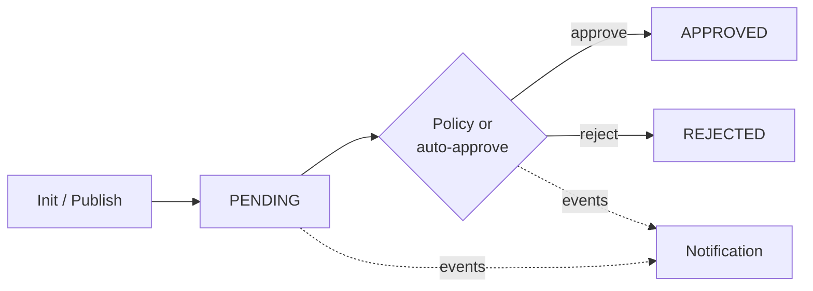

# ODM Platform Registry Server

> The product-plane registry for the [Open Data Mesh Platform](https://dpds.opendatamesh.org/) —  
> register data products, publish versioned descriptors, and drive approval through an event-based lifecycle.

<p align="center">
  <a href="https://github.com/opendatamesh-initiative/odm-platform-pp-registry-server/actions/workflows/ci.yml"></a>
  <a href="https://github.com/opendatamesh-initiative/odm-platform-pp-registry-server/actions/workflows/cicd.yml"></a>
  <a href="https://github.com/opendatamesh-initiative/odm-platform-pp-registry-server/releases/latest"></a>
  <a href="https://opensource.org/licenses/Apache-2.0"></a>
</p>

<p align="center">
  <a href="https://openjdk.org/"></a>
  <a href="https://spring.io/projects/spring-boot"></a>
  <a href="https://hub.docker.com/r/opendatamesh/odm-platform-registry"></a>
  <a href="https://github.com/opendatamesh-initiative/odm-platform-pp-registry-server/commits/main"></a>
  <a href="https://github.com/opendatamesh-initiative/odm-platform-pp-registry-server/issues"></a>
</p>

<p align="center">
  <a href="#quick-start-local">Quick start</a> ·
  <a href="#run-with-docker">Docker</a> ·
  <a href="#documentation">Documentation</a> ·
  <a href="#contributing">Contributing</a>
</p>

---

## Why this service

In a data mesh, products need a shared place for **identity**, **metadata**, and **governed publication**.  
The Registry Server is that place: it stores data products and their DPDS descriptors, validates them on publish, and moves them through approval with Notification (and optional Policy) in the loop.



## Highlights

| Capability | Details |
|:-----------|:--------|
| **Lifecycle** | Init products and publish versions with explicit `PENDING` / `APPROVED` / `REJECTED` states |
| **Descriptors** | DPDS validation and enrichment at publish time |
| **Governance** | Event-driven decisions via Notification; optional Policy Service gate |
| **Git** | Read/write descriptors and inspect repos on GitHub, GitLab, Bitbucket, Azure DevOps |
| **Variables** | `${placeholder}` values per version, with resolve APIs |
| **Compatibility** | V1 API bridge for existing clients and Policy Service V1 |

> **New to V2?** Start with [What's new in V2](docs/service/v2-whats-new.md).

---

## Quick start (local)

**Requirements:** Java **21** · Maven **3.6+** (or `./mvnw`)

```bash
git clone https://github.com/opendatamesh-initiative/odm-platform-pp-registry-server.git
cd odm-platform-pp-registry-server

mvn clean install
mvn spring-boot:run -Dspring-boot.run.profiles=dev
```

The `dev` profile uses an in-memory **H2** database. When the server is up:

| | Endpoint |
|:--|:---------|
| **Swagger UI** | [http://localhost:8080/swagger-ui.html](http://localhost:8080/swagger-ui.html) |
| **OpenAPI** | [http://localhost:8080/api-docs](http://localhost:8080/api-docs) |

More detail (profiles, Postgres, tests): [Development](docs/setup/development.md)

---

## Run with Docker

Release images are published to **[Docker Hub](https://hub.docker.com/r/opendatamesh/odm-platform-registry)**  
(and may also be available from **GitHub Container Registry**).

```bash
docker pull opendatamesh/odm-platform-registry:2.0.11
```

1. Provision **PostgreSQL**, **Notification**, and optionally **Policy**
2. Inject configuration (`DB_*` and/or `SPRING_PROPS`)
3. Run the container and point `server.baseUrl` at a reachable Registry URL

| Guide | Link |
|:------|:-----|
| Step-by-step deploy | [Deployment](docs/setup/deployment.md) |
| Properties to manage | [Configuration](docs/setup/configuration.md) |

---

## Documentation

All guides live under [`docs/`](docs/README.md).

<details open>
<summary><strong>Service</strong></summary>

<br>

| Guide | Description |
|:------|:------------|
| [Data product lifecycle](docs/service/data-product-lifecycle.md) | Products, versions, and init → approve |
| [Data product variables](docs/service/data-product-variables.md) | Placeholder storage and resolve |
| [Descriptor validation](docs/service/descriptor-validation.md) | Publish-time DPDS checks |
| [Events](docs/service/events.md) | Notification-driven approval |
| [Git providers](docs/service/git-providers.md) | Git hosts and client-supplied auth |
| [Policy service](docs/service/policy-service.md) | Governance gate vs auto-approve |
| [What's new in V2](docs/service/v2-whats-new.md) | Conceptual changes in Registry V2 |
| [V1 backward compatibility](docs/service/v1-backward-compatibility.md) | Legacy bridge overview |

</details>

<details open>
<summary><strong>Setup</strong></summary>

<br>

| Guide | Description |
|:------|:------------|
| [Development](docs/setup/development.md) | Build, run, profiles, testing |
| [Deployment](docs/setup/deployment.md) | Containers, image registries, checklist |
| [Configuration](docs/setup/configuration.md) | Properties to manage + minimal example |

</details>

---

## Contributing

Contributions are welcome.

1. Fork the repository and create a feature branch  
2. Make your changes with clear commits  
3. Open a pull request against the main branch  

Bugs, questions, or proposals → [open an issue](https://github.com/opendatamesh-initiative/odm-platform-pp-registry-server/issues).

---

## License

Licensed under the [Apache License 2.0](https://www.apache.org/licenses/LICENSE-2.0).

Part of the [Open Data Mesh Initiative](https://github.com/opendatamesh-initiative).
