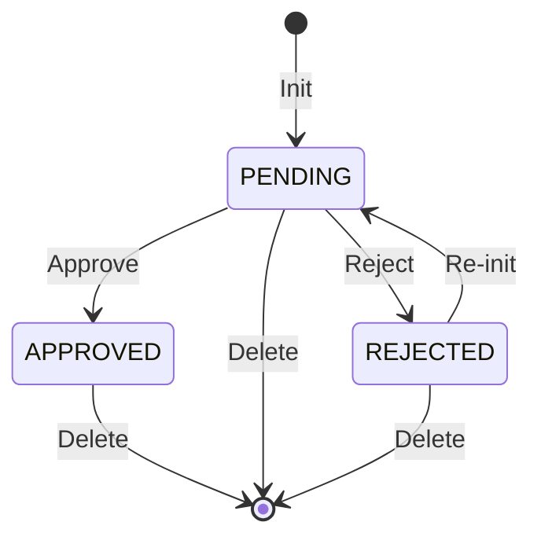
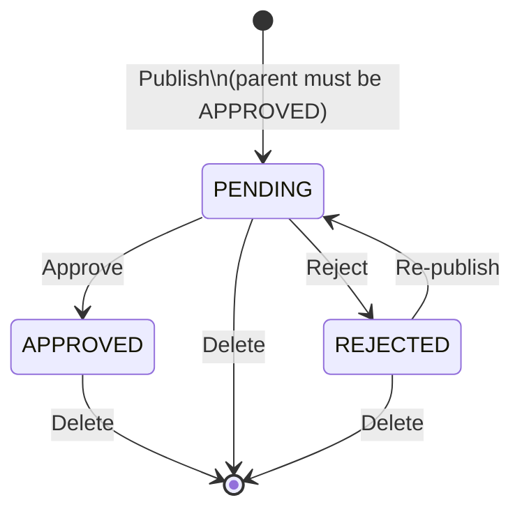

# Data product lifecycle

High-level view of how data products and their versions are registered, approved, and published in Registry V2.

Related:

- [Events](events.md) — event types and payloads
- [Policy service](policy-service.md) — approval vs auto-approve
- [Descriptor validation](descriptor-validation.md) — rules applied on publish
- [Data product variables](data-product-variables.md) — placeholders and resolve
- [What's new in V2](v2-whats-new.md) — API surface overview

## What is a Data Product?

A **Data Product** is the Registry’s long-lived identity and metadata record for a product in the mesh. It represents *the product itself*, not a particular release of its descriptor.

In practice it holds:

- **Identity**: UUID and fully qualified name (FQN)
- **Catalog metadata**: domain, name, display name, description
- **Optional Git link**: a `dataProductRepo` pointing at the product’s repository
- **Validation state**: whether the product has been accepted into the registry (`PENDING`, `APPROVED`, or `REJECTED`)

A data product must be **approved** before any version of it can be published. Deleting a data product also removes its versions.

## What is a Data Product Version?

A **Data Product Version** is a specific, versioned snapshot of a data product’s **descriptor** (typically DPDS), owned by one parent data product.

It holds:

- **Link to the parent** data product
- **Version identity**: version number (and related tag/name/description)
- **Descriptor**: specification type/version plus the full descriptor content
- **Validation state**: whether that version has been accepted (`PENDING`, `APPROVED`, or `REJECTED`)

Publishing a version means submitting a descriptor for approval. The version becomes effectively “published” only when it is **approved**. A product may have multiple approved versions over time (different version numbers).

```text
Data Product  (identity + catalog metadata)
    └── Data Product Version 1.0.0  (descriptor snapshot)
    └── Data Product Version 1.1.0  (descriptor snapshot)
    └── …
```

## Validation states

Both entities share the same three states:

| State | Meaning |
|-------|---------|
| `PENDING` | Submitted; waiting for approval or rejection |
| `APPROVED` | Accepted. For a product: versions may be published. For a version: the descriptor is considered published. |
| `REJECTED` | Not accepted. The same FQN / version number can be submitted again (the rejected record is replaced). |

## Lifecycle overview

The Registry treats registration as an **async approval flow**:

1. A client **initializes** a data product or **publishes** a version → resource is stored as `PENDING` and a `*_REQUESTED` event is emitted.
2. Policy (or Registry auto-approve when Policy is inactive) responds with `*_APPROVED` or `*_REJECTED`.
3. The Registry Observer applies the decision → resource becomes `APPROVED` or `REJECTED` (and success events such as `INITIALIZED` / `PUBLISHED` are emitted on approve).

```text
Init / Publish
      │
      ▼
  PENDING  +  emit *_REQUESTED
      │
      ▼
  Policy or auto-approve
      │
      ├──► APPROVED  (+ INITIALIZED / PUBLISHED)
      └──► REJECTED
```

Details of events and Policy modes: [Events](events.md), [Policy service](policy-service.md).

## Data product flow

Typical path:

1. **Init** — create the product (`PENDING`). Same FQN cannot be re-initialized if already `PENDING` or `APPROVED`; a prior `REJECTED` product is replaced.
2. **Approve or reject** — usually via Notification events, not direct client calls.
3. Once **APPROVED**, versions can be published.
4. **Documentation fields** (display name, description, repo) can be updated without changing validation state.
5. **Delete** removes the product and cascades to its versions.



## Data product version flow

Typical path:

1. Parent data product must already be **APPROVED**.
2. **Publish** — submit a descriptor; Registry validates it (see [Descriptor validation](descriptor-validation.md)) and stores the version as `PENDING`.  
   Note: “publish” here means *request publication*; the version is fully published only after approve.
3. **Approve or reject** — via the same event-driven path as products.
4. Same version number cannot be republished while `PENDING` or `APPROVED`; a prior `REJECTED` version can be replaced.
5. **Documentation fields** and **variable resolve** do not change validation state.



## Key rules (summary)

- A version can be published or approved only if its parent product is `APPROVED`.
- Approve / reject apply only to `PENDING` resources.
- Re-submission of the same FQN or version number is allowed after `REJECTED`, not while `PENDING` or `APPROVED`.
- There is no “un-approve” path: leaving `APPROVED` means delete (or, after reject + replace, a new pending submission).

For API entry points and V2 capabilities, see [What's new in V2](v2-whats-new.md).
