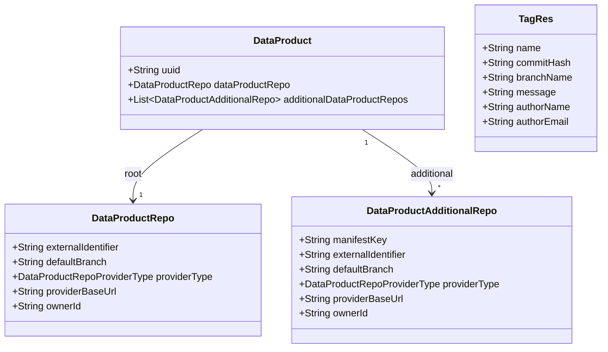

# BDMD-4820 — Tag all data product repositories

## Requirements

Create the same Git tag on **every** Git remote of a data product from **one** `POST /api/v2/pp/registry/products/{uuid}/repository/tags` call, so version publish does not leave additional remotes untagged.

**Who / value:** Builder and other clients already POST once via product repository tags. Polyrepo products store additional remotes on the data product; the server must apply the tag to those remotes as well as the root.

**Boundary:** odm-platform-pp-registry-server only. Do **not** modify the UI, agent, or blueprint-server. Do not change `GET /tags`, commits, or branches. Do not add a new Git-provider create-tag endpoint. Do not add `manifestKey` (or similar) to select a subset of remotes — this POST always targets root plus all additional remotes.

**Decided in analysis:**

- Rename `DataProductRepositoryUtilsService.addTag` to `tagAllDataProductRepositories`. REST method stays `createTag`.
- Document fan-out on the endpoint OpenAPI description.
- Same tag name, message, and author on every remote. Pointer resolution is per remote: `commitHash` applies to the **root** only; additional remotes use request `branchName` when present, otherwise that remote’s `defaultBranch`.
- Empty additional collection: root-only, as today.
- First Git failure after that point returns 400; do not roll back tags already pushed.
- Add an IT with a Gherkin Feature/Scenario block on top.
- **Existing tag (already on root):** do not create again. Ensure every additional remote already has that tag name. If not, fail with recovery text. Do not auto-create the missing tag.
- **New tag (not on root):** create on root and additional remotes. If an additional remote already has that tag name, fail with recovery text.
- **New tag on a branch other than that additional remote’s default branch:** create on additional remotes only if they have that branch. If they do not, fail with recovery text.
- Every such 400 names the additional repository (`manifestKey`) and tells the user what to do before retrying publish.
- Builder must POST `/tags` for **both** new and existing tags (existing-tag verification cannot run if the client skips the call).

## Entities

**Conservative notes:** Reuse `TagRes`. Do not invent a new request body. Do not tag through a second HTTP resource.

## Approach

1. Keep `DataProductRepositoryController.createTag` as the HTTP entry. Delegate to `tagAllDataProductRepositories`.
2. Load the data product (404 if missing). Require a root repository (400 if absent, same message as today). Require a non-blank tag name (400 `Missing tag name`).
3. Resolve whether the tag **already exists on the root** (list tags on the root remote).
4. **Existing on root:** do not create on root. For each additional remote, list tags; if the name is missing, fail with the existing-tag recovery message. If every additional remote has it, return 201 with no new Git tag writes.
5. **New tag:** create on the root, then for each additional remote: fail if the tag name already exists (new-tag recovery message); if request `branchName` is present and differs from that remote’s `defaultBranch`, fail if that branch is absent (missing-branch recovery message); otherwise create the tag (request `branchName` or that remote’s `defaultBranch`).
6. Document the contract on `@Operation` (summary + description), including the three publish scenarios and recovery-oriented errors.

## Structure

### Inheritance Relationships

No new types. `DataProductRepositoryUtilsServiceImpl` remains the only implementation of `DataProductRepositoryUtilsService`. Existing `BadRequestException` / not-found behaviour stays.

### Dependencies

1. Controller → `DataProductRepositoryUtilsService.tagAllDataProductRepositories`.
2. Service → `DataProductsService.findOne`, `GitProviderFactory`, Git `GitProvider.listTags` / `listBranches`, Git `GitOperation` (`readRepository`, `getHeadSha`, `addTag`, `push`).
3. Tests → `DataProductDescriptorControllerIT` with `GitProviderFactoryMock`, stub `getRepository` per remote id.

### Layered Architecture

1. REST: `DataProductRepositoryController`.
2. Application: `DataProductRepositoryUtilsService` / `Impl`.
3. Domain persistence: `DataProduct`, `DataProductRepo`, `DataProductAdditionalRepo`.
4. Git: existing provider factory and operations.

### Placement

- `src/main/java/org/opendatamesh/platform/pp/registry/rest/v2/controllers/DataProductRepositoryController.java`
- `src/main/java/org/opendatamesh/platform/pp/registry/dataproduct/services/DataProductRepositoryUtilsService.java`
- `src/main/java/org/opendatamesh/platform/pp/registry/dataproduct/services/DataProductRepositoryUtilsServiceImpl.java`
- IT: `src/test/java/org/opendatamesh/platform/pp/registry/rest/v2/controllers/DataProductDescriptorControllerIT.java`

## Operations

### Rename service method to `tagAllDataProductRepositories`

1. Replace `addTag` on the interface, implementation, and controller call site.
2. Do not leave aliases or unused `addTag` methods.

### Document `POST /tags`

1. Add `@Operation` on `createTag` with a summary such as “Create Git tag on all data product repositories”.
2. Description must state, in natural language: the call applies the given tag name across the **root** repository **and every additional data product repository**. If the tag already exists on the root, the call **verifies** that every additional remote already has that tag name and does not create tags. If the tag does not exist on the root, the call **creates** it on the root and on additional remotes, and fails if an additional remote already has that tag or (when tagging a non-default branch) does not have that branch. The body is unchanged (`TagRes`). Commit hashes apply to the root only. GET `/tags` still lists only the root. Git work is not transactional. Failed consistency checks return 400 with the additional repository identity and a recovery suggestion before retrying publish.

### Implement fan-out in `tagAllDataProductRepositories`

1. Keep today’s root validation (product exists, root repository present, non-blank tag name).
2. Load the root Git remote. List its tags (page size 100, walk pages until found or exhausted). If the requested name is present, run **existing-tag** mode; otherwise **new-tag** mode.
3. **Existing-tag mode:** do not clone or create on root. For each additional remote, list tags. If the name is missing, throw `BadRequestException` with exactly: `Tag '{name}' exists on the root repository but is missing on additional repository '{manifestKey}'. Create tag '{name}' on that additional repository, then retry publishing.` Use `manifestKey` when present, otherwise the remote name. Do not create the missing tag. If every additional remote has it, return 201 with no new Git tag writes.
4. **New-tag mode — checks before any create:** for each additional remote, if `externalIdentifier` or `ownerId` is blank, throw identity `BadRequestException` as today. If `getRepository` is empty, throw the same “No remote repository was found” style as the root. If the tag name already exists on that remote, throw `BadRequestException` with exactly: `Cannot create tag '{name}': it already exists on additional repository '{manifestKey}'. Choose a different tag name, or delete that tag on the additional repository, then retry publishing.` If request `branchName` has text and is not equal to that remote’s `defaultBranch`, list branches; if the named branch is absent, throw `BadRequestException` with exactly: `Cannot create tag '{name}' from branch '{branch}': additional repository '{manifestKey}' does not have that branch. Create branch '{branch}' on that additional repository (or tag from a branch that exists on every repository), then retry publishing.` Run these checks **before** creating on the root so a failed publish does not leave the tag only on the root (which would flip the next retry into existing-tag mode).
5. **New-tag mode — create:** create on the root (including `retrieveTagTargetCommit`), then create on each additional remote (branch = request `branchName` or additional `defaultBranch`). If that branch name is blank, throw `BadRequestException` (do not skip the remote).
6. Log tag name and which remote (root vs additional `manifestKey`) on success and on Git failure. Consistency failures use the exact messages above, not the generic wrap. Unexpected Git failures still wrap as `Failed to create tag: ` plus the cause.

### Add IT with Gherkin

Keep the existing success IT (new tag, additional remotes, `addTag` once per remote). Add three more ITs in the same class, each with a Feature/Scenario comment immediately above the method:

1. Existing tag missing on additional — Given the tag exists only on the root When POST /tags Then 400 and the body contains the existing-tag recovery message; `addTag` is never invoked.
2. New tag already on additional — Given the tag is absent on the root and present on an additional remote When POST /tags Then 400 and the body contains the already-exists recovery message; `addTag` is never invoked.
3. New tag from a non-default branch missing on additional — Given additional remotes have default branch `main` and no `develop` When POST /tags with `branchName=develop` Then 400 and the body contains the missing-branch recovery message; `addTag` is never invoked.

Stub `GitProvider.listTags` and `listBranches` per remote id. Default IT setup may return empty tag pages so existing create-tag tests still create.

## Norms

Re-read these files during `/spdd-generate`:

1. **Use-case vs existing Git utils:** Do **not** introduce a new `*UseCaseController` / factory / ports slice for this change (`spdd/norms/USE_CASE_IMPLEMENTATION.md`). Fan-out stays on the existing repository utils service. Apply that norm’s **REST** rules that already fit this controller: thin HTTP mapping, OpenAPI `@Operation` / `@ApiResponses` / `@Parameter` on `createTag`.
2. **CRUD:** Do **not** recast tagging as Generic CRUD (`spdd/norms/GENERIC-CRUD-GUIDELINES.md`). Persistence of remotes is already on `DataProductsService`; this operation only uses `findOne`.
3. Controller stays thin; Git work stays in `DataProductRepositoryUtilsServiceImpl`.
4. Use `BadRequestException` / existing not-found from `findOne`. No new exception types.
5. Constructor injection; `@Service` on the impl.
6. Tests extend `RegistryApplicationIT`, use `GitProviderFactoryMock`, create products via REST, clean up with DELETE.
7. Do not add `utils` packages or new controllers for this behaviour.

## Safeguards

1. **Functional:** One POST tags or verifies root and all additional remotes. Root-only products unchanged. Existing tag: verify only. New tag: create; fail if additional already has the tag or lacks a non-default branch.
2. **Security:** Git credentials remain request headers; do not log tokens or secret values.
3. **Integration:** Path and method unchanged. Clients that publish a version with an **existing** tag must still POST `/tags`.
4. **Business rules:** Do not skip additional remotes. `commitHash` is root-only. Do not auto-create a tag when verifying an existing root tag.
5. **Exception / recovery:** Use the exact 400 messages specified in Operations for missing tag, duplicate tag, and missing branch. Unexpected Git failure → `Failed to create tag: …`. No tag rollback.
6. **Technical:** Method name is exactly `tagAllDataProductRepositories`. OpenAPI description states fan-out and the three publish scenarios. ITs have Gherkin blocks above the methods.
7. **API contract:** 201 body remains the submitted `TagRes`. GET `/tags` still lists the root only.
