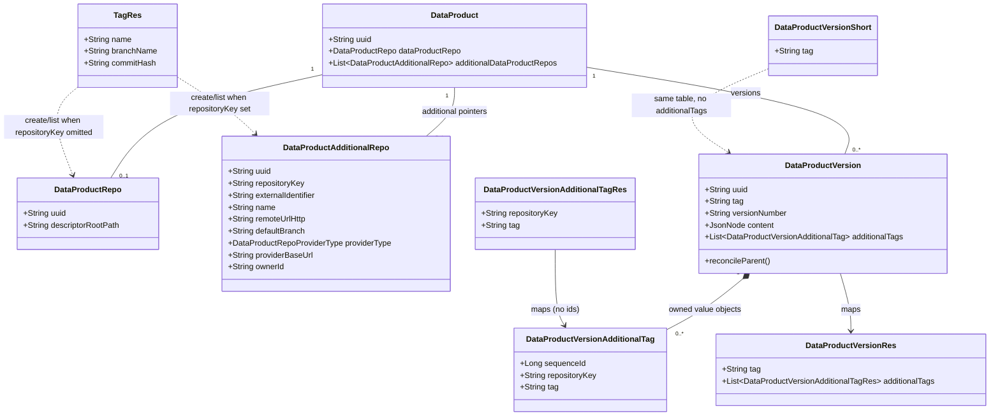

# Persist polyrepo data product version snapshot tags and target additional remotes for Git tag operations

## Requirements

- Record which Git tag on each additional data product remote belongs to a published data product version, so a polyrepo version’s Git snapshot is reconstructible.
- Keep the root repository pointer on the Data Product and the root `tag` on the Data Product Version as version identity (uniqueness, search, delete-by-tag, compact events).
- Keep additional repository pointers on the Data Product (already modeled); store only per-remote tag names on the version, keyed by the same repository key.
- Require a complete additional-tag set at publish when the product currently has additional remotes; empty additional tags only when there are no additional remotes (mono-repo).
- Let clients list tags/branches and create tags against a stored additional remote as well as the root, without changing Git-omitted (root) behavior for mono-repo callers.
- Treat additional version tags as value objects owned by the version: persist with a surrogate `sequence_id`, never expose a UUID or sequence id on the API.
- Do not create Git tags inside publish; do not replace root `tag` with a list; do not add Flyway `V3` or backfill — extend undeployed `V2` in place.

## Entities

## Approach

1. Persistence (undeployed `V2` in place):
   - Edit `src/main/resources/db/migration/postgresql/V2__data_products_additional_repositories.sql` only. Add child table for version additional tags as **owned value objects**: surrogate `sequence_id` (`bigserial`) PK, required `repository_key` and `tag`, FK to `data_products_versions(uuid)` `ON DELETE CASCADE`. No UUID column. No FK to additional-repository rows. **Do not add database UNIQUE constraints** (not on additional remotes, not on version additional tags). Enforce one repository key per product remotes list and one repository key per version additional-tags list in **core services** (`DataProductsServiceImpl` already does remotes; `DataProductVersionCrudServiceImpl` does version tags). No `V3`. Rebuild local/test DBs if Flyway checksum changes.
   - JPA: persist `DataProductVersionAdditionalTag` as a child row of the version aggregate (same collection pattern as descriptor variables: `IDENTITY` `sequenceId`, `ManyToOne` parent, `OneToMany` + `orphanRemoval` + `CascadeType.ALL` on the version). It is a **value object in the domain**, not an independently addressable aggregate: no UUID, no CRUD service, no REST id. Join to remotes by `repositoryKey` string, not additional-repo UUID. No unique JPA constraints.

2. API and mapping:
   - Additive `additionalTags` on `DataProductVersionRes` only (full resource). Each item is only `repositoryKey` + `tag`. Do **not** expose `uuid` or `sequenceId`. Leave `DataProductVersionShort` / `DataProductVersionShortRes` root-tag-only.
   - MapStruct mapper for additional tags; wire into `DataProductVersionMapper` (`uses = ...`). On `toEntity`, ignore parent version **and** `sequenceId` (database-generated). Reconcile parent in CRUD. On `toRes`, map only `repositoryKey` and `tag`.
   - Git: optional query parameter `repositoryKey` on existing `GET/POST .../products/{uuid}/repository/{commits|branches|tags}`. Omitted or blank → root `dataProductRepo`. Set → resolve `DataProductAdditionalRepo` by that key or `BadRequestException`.

3. Business logic:
   - Completeness lives in `DataProductVersionPublisher` after the product is loaded: if the product has additional remotes, the command version must contain exactly one additional tag per current repository key (no extras, no missing, no duplicate keys, each tag name required). Throw `BadRequestException`.
   - CRUD `validate` on `DataProductVersionCrudServiceImpl` enforces field lengths and **duplicate additional-tag repository keys in the collection** (`BadRequestException`); does **not** enforce completeness against the product (validate runs before reconcile). Root tag uniqueness stays in core `validateNaturalKeyConstraints` (not the database). Additional tag names are **not** unique across versions. Additional remote duplicate keys stay in `DataProductsServiceImpl.validate` (already implemented; do not add a DB unique).
   - Documentation-fields update still only name/description/`updatedBy` — additional tags immutable after publish.
   - Compact notification payloads that copy a single `tag` stay root identity. Publication-requested already maps the full version via `DataProductVersionMapper.toRes` — additional tags flow once mapped.
   - Existing `BadRequestException` / `ResourceConflictException` and the project’s exception advice; do not add a new exception type or `GlobalExceptionHandler`.

## Structure

### Inheritance Relationships

1. `DataProductVersionCrudServiceImpl` continues to extend `GenericMappedAndFilteredCrudServiceImpl` (`spdd/norms/GENERIC-CRUD-GUIDELINES.md`).
2. `DataProductVersionPublisher` continues to implement `UseCase` (`spdd/norms/USE_CASE_IMPLEMENTATION.md`).
3. `DataProductVersionAdditionalTag` is a **value object** owned by `DataProductVersion`. Persist it as a JPA child (surrogate `sequenceId`) following `DescriptorVariable`; it is not a CRUD aggregate, has no REST identifier, and is not independently loadable.
4. `DataProductRepositoryUtilsServiceImpl` implements `DataProductRepositoryUtilsService` (existing; extend signatures).

### Dependencies

1. `DataProductVersionsUseCasesService.publishDataProductVersion` maps `DataProductVersionRes` (including `additionalTags`) via existing `DataProductVersionMapper` into `DataProductVersionPublishCommand`.
2. `DataProductVersionPublisher` loads `DataProduct` via `DataProductVersionPublisherDataProductPersistenceOutboundPort`, then validates additional-tag completeness against `additionalDataProductRepos`.
3. `DataProductVersionPublisherDataProductVersionPersistenceOutboundPort.save` persists the version graph (cascade additional tags).
4. `DataProductRepositoryController` passes optional `repositoryKey` into `DataProductRepositoryUtilsService`.
5. `DataProductRepositoryUtilsServiceImpl` loads the product, resolves root vs additional pointer, then builds the Git provider from **that** pointer’s provider type/base URL.

### Layered Architecture

1. Controller: `DataProductVersionUseCaseController` unchanged routes; `DataProductRepositoryController` adds optional `repositoryKey`.
2. Use cases service: existing publish mapping; no new use case.
3. Use case: completeness policy in publisher; Git create stays outside publish.
4. Core CRUD: collection reconcile + field validation and in-memory uniqueness of additional-tag repository keys; additional-remote key uniqueness remains in `DataProductsServiceImpl`.
5. Git utils service: remote resolution then existing git-utils/provider calls.
6. Exception handling: existing global handler.

## Operations

### Update Flyway - `V2__data_products_additional_repositories.sql`

1. Responsibility: Single undeployed schema for additional remotes and version snapshot tags.
2. Changes:
   - Keep `data_products_additional_repositories` as today (no unique index).
   - Create `data_products_versions_additional_tags` with: `sequence_id` `bigserial` primary key, `repository_key` varchar(255) not null, `tag` varchar(255) not null, `data_product_version_uuid` varchar(36) not null references `data_products_versions(uuid) on delete cascade`. No `uuid` column. No unique constraint on `(data_product_version_uuid, repository_key)`.
3. Constraints: Do not add `V3`. Do not FK to `data_products_additional_repositories`. Do not add any UNIQUE constraints.

### Create Persistence Type - `DataProductVersionAdditionalTag`

1. Responsibility: Value object: one snapshot tag name for one additional remote on one version. Not independently addressable.
2. Attributes:
   - `sequenceId`: Long — surrogate PK, `GenerationType.IDENTITY` (same as `DescriptorVariable`). Persistence-only; never mapped to REST.
   - `repositoryKey`: String — logical identity within the parent version; matches additional remote key
   - `tag`: String — Git tag name on that remote
   - `dataProductVersion`: DataProductVersion — owning parent
   - `dataProductVersionUuid`: String — denormalized column, insertable/updatable false (same pattern as descriptor variables)
3. Table: `data_products_versions_additional_tags`
4. Constraints: `repositoryKey` and `tag` required at JPA/column level. No unique annotations or unique indexes. Do not generate or store a UUID.
5. Contrast: `DataProductAdditionalRepo` remains an entity with UUID (product-owned pointer). Additional tags do not: they have no lifecycle outside the version, no dedicated endpoints, and clients identify them only by `repositoryKey` on that version.

### Update Entity - `DataProductVersion`

1. Responsibility: Own additional snapshot tags.
2. Add `List<DataProductVersionAdditionalTag> additionalTags` with `@OneToMany(mappedBy = "dataProductVersion", orphanRemoval = true, cascade = CascadeType.ALL)` and `@Fetch(FetchMode.SELECT)` matching `DataProduct.additionalDataProductRepos`.
3. Getters/setters. Do **not** add the collection to `DataProductVersionShort`.

### Create Resource + Mapper - `DataProductVersionAdditionalTagRes` / `DataProductVersionAdditionalTagMapper`

1. Fields: `repositoryKey`, `tag` with `@Schema` only. Do **not** add `uuid` or `sequenceId` to the resource.
2. MapStruct `@Mapper(componentModel = "spring")`: `toEntity` ignores `dataProductVersion` and `sequenceId`; `toRes` maps `repositoryKey` and `tag` only.
3. Update `DataProductVersionMapper` `uses = DataProductVersionAdditionalTagMapper.class` so `additionalTags` maps on full entity/res. Short mapping unchanged.

### Update Resource - `DataProductVersionRes`

1. Add `List<DataProductVersionAdditionalTagRes> additionalTags` with schema: optional additional Git snapshot tags keyed by repository key; omitted/empty for mono-repo.

### Update Core CRUD - `DataProductVersionCrudServiceImpl`

1. In `validate` / `validateFieldConstraints`: for each additional tag (if list non-null), require repository key and tag name; length ≤ 255.
2. In the same core `validate` path, reject duplicate `repositoryKey` values within `additionalTags` (`BadRequestException`), matching `DataProductsServiceImpl.validateAdditionalDataProductRepos` for remotes. This is the uniqueness check — not the database.
3. In `reconcile`: if additional tags present, set only the owning `DataProductVersion` on each child. Do not accept or copy a client-supplied identity (`sequenceId` / uuid). Orphan-removal replace-set is the correct lifecycle for value objects (new rows get new sequence ids; removed rows are deleted).
4. Do **not** change `validateNaturalKeyConstraints` (root tag uniqueness remains core-service only). Do **not** add repository `existsBy...` uniqueness for additional tag names across versions.

### Update Use Case - `DataProductVersionPublisher`

1. After `verifyDataProductIsApproved` / FQN match (product already loaded), call a private completeness step:
   - Collect current additional remote keys from `dataProduct.getAdditionalDataProductRepos()` (treat null as empty).
   - Collect additional tags from the command version (treat null as empty).
   - If remote keys empty: additional tags must be empty; otherwise `BadRequestException`.
   - If remote keys non-empty: every remote key must have exactly one tag with non-blank `tag`; no additional tag whose key is not on the product; no duplicate keys.
2. Persist via existing `save` (cascade). Do not call Git.
3. Keep composed-method / ports-only style (`spdd/norms/USE_CASE_IMPLEMENTATION.md`).

### Update Git targeting - `DataProductRepositoryController` + `DataProductRepositoryUtilsService` + impl

1. Add optional `@RequestParam(required = false) String repositoryKey` to list commits, list branches, list tags, create tag. Document: omitted = root repository.
2. Extend service methods with `String repositoryKey` after `dataProductUuid` (or equivalent consistent position).
3. In impl, private resolve:
   - Blank `repositoryKey` → `getDataProductRepo()` or `BadRequestException` (“does not have an associated repository”) as today.
   - Non-blank → find additional repo with that key or `BadRequestException` (unknown key / no additional remotes).
4. Build Git `Repository` and `GitProviderIdentifier` from the **resolved** pointer (additional remotes have no descriptor path; tag create already does not need it). Reuse `addTag` / list logic; generalize `buildRepoObject` / `retrieveTagTargetCommit` to accept the fields shared by root and additional (name, urls, default branch, owner, provider) rather than only `DataProductRepo`.
5. Default branch for tag-without-branch remains the resolved pointer’s `defaultBranch`.

### Tests - unit and IT

1. Extend `DataProductVersionPublisherTest`: polyrepo complete tags succeed; missing key fails; extra key fails; duplicate key fails; empty tags with additional remotes fail; additional tags with no remotes fail; same additional tag name as root allowed; two versions sharing additional tag name is a persistence concern covered in IT.
2. Extend `DataProductVersionUseCaseControllerIT`: publish with additional remotes + matching additional tags returns `repositoryKey` and `tag` only (no `uuid` / `sequenceId`); GET by uuid returns the same; short list still has only root `tag`; documentation-fields update does not change additional tags; mono-repo publish omits/empties additional tags.
3. Keep existing `DataProductControllerIT` coverage that duplicate additional-remote `repositoryKey` is rejected by core validation (HTTP 400), not by a DB unique violation.
4. Extend `DataProductDescriptorControllerIT` (or a repository controller IT): list/create tags without `repositoryKey` still uses root; with `repositoryKey` uses that additional remote (mock Git provider/operation); unknown key → 400.

### High-level tests (Gherkin)

Feature: Polyrepo version snapshot tags
  Scenario: Publish stores a tag per additional remote
    Given an approved data product with root repository and additional remotes keyed "infra-repo" and "app-repo"
    When the client publishes a version with root tag "1.0.0" and additional tags for those keys
    Then the version is persisted with those additional tags
    And the publication result includes the additional tags

  Scenario: Mono-repo publish has no additional tags
    Given an approved data product with only a root repository
    When the client publishes a version with root tag "1.0.0" and no additional tags
    Then the version is persisted with an empty additional tag collection
    And behavior matches today’s publish

Feature: Snapshot completeness
  Scenario: Missing additional tag is rejected
    Given the product has additional remotes "infra-repo" and "app-repo"
    When the client publishes with an additional tag only for "infra-repo"
    Then the request fails with a bad request

  Scenario: Unknown additional tag key is rejected
    Given the product has additional remote "infra-repo"
    When the client publishes with an additional tag keyed "other-repo"
    Then the request fails with a bad request

  Scenario: Additional tags on a mono-repo product are rejected
    Given the product has no additional remotes
    When the client publishes with any additional tag
    Then the request fails with a bad request

Feature: Identity and immutability
  Scenario: Root tag remains unique; additional tag names are not
    Given a version already uses additional tag "1.0.0" on "infra-repo"
    When another version is published with a different root tag and additional tag "1.0.0" on "infra-repo"
    Then the second publish succeeds

  Scenario: Documentation update does not change additional tags
    Given a published version with additional tags
    When the client updates name and description
    Then additional tags are unchanged

Feature: Git targeting of additional remotes
  Scenario: Omit repository key uses the root repository
    Given a data product with root and additional remotes
    When the client lists or creates tags without repositoryKey
    Then Git operations use the root pointer

  Scenario: Repository key selects an additional remote
    Given a data product with additional remote "infra-repo"
    When the client lists or creates tags with repositoryKey "infra-repo"
    Then Git operations use that additional pointer’s provider and URLs

  Scenario: Unknown repository key is rejected
    When the client lists tags with a repositoryKey that is not on the product
    Then the request fails with a bad request

| Feature / Scenario | Test class | Method |
| --- | --- | --- |
| Polyrepo version snapshot tags / Publish stores a tag per additional remote | `DataProductVersionUseCaseControllerIT` | `whenPublishWithAdditionalTagsThenReturnThemOnResult` |
| Polyrepo version snapshot tags / Mono-repo publish has no additional tags | `DataProductVersionUseCaseControllerIT` | `whenPublishMonoRepoThenAdditionalTagsAreEmpty` |
| Snapshot completeness / Missing additional tag is rejected | `DataProductVersionPublisherTest` | `whenAdditionalRemoteMissingTagThenThrowBadRequestException` |
| Snapshot completeness / Unknown additional tag key is rejected | `DataProductVersionPublisherTest` | `whenAdditionalTagKeyUnknownThenThrowBadRequestException` |
| Snapshot completeness / Additional tags on a mono-repo product are rejected | `DataProductVersionPublisherTest` | `whenAdditionalTagsPresentWithoutRemotesThenThrowBadRequestException` |
| Identity and immutability / Root tag remains unique; additional tag names are not | `DataProductVersionUseCaseControllerIT` | `whenSecondVersionReusesAdditionalTagNameThenSucceed` |
| Identity and immutability / Documentation update does not change additional tags | `DataProductVersionUseCaseControllerIT` | `whenUpdateDocumentationFieldsThenAdditionalTagsUnchanged` |
| Git targeting / Omit repository key uses the root repository | `DataProductDescriptorControllerIT` (or repository IT) | `whenCreateTagWithoutRepositoryKeyThenUseRootRepository` |
| Git targeting / Repository key selects an additional remote | `DataProductDescriptorControllerIT` (or repository IT) | `whenCreateTagWithRepositoryKeyThenUseAdditionalRepository` |
| Git targeting / Unknown repository key is rejected | `DataProductDescriptorControllerIT` (or repository IT) | `whenListTagsWithUnknownRepositoryKeyThenReturnBadRequest` |

Copy each Scenario text into the Javadoc of the corresponding test method.

## Norms

Cite only files read from `spdd/norms/README.md`:

1. Use cases (`spdd/norms/USE_CASE_IMPLEMENTATION.md`): REST resources stay out of `...services.usecases.publish`; completeness is publisher **business logic**, not adapter hiding; ports remain domain-typed; factory is the only `@Component` in that slice; composed-method / step-down; ITs on the use-case controller.
2. CRUD (`spdd/norms/GENERIC-CRUD-GUIDELINES.md`): `validate` = field/collection invariants **including duplicate additional-tag keys**; `reconcile` = parent links only (no identity assignment); uniqueness of root tag stays in `beforeCreation` / `beforeOverwrite`; do not invent a separate CRUD service, repository, or REST resource for additional tags; do not push uniqueness to Flyway.
3. Exception handling: existing `BadRequestException` / `ResourceConflictException` and global advice — no new handler.
4. Dependency injection: constructor injection on services; MapStruct `componentModel = "spring"`.
5. Logging: follow existing `DataProductRepositoryUtilsServiceImpl` info/warn around tag create; name the repository key when targeting additional remotes.

## Safeguards

1. Functional: Do not remove or rename root `tag`. Do not put additional tags on `DataProductVersionShort`. Do not create Git tags in publish. Do not change descriptor read (root only).
2. Schema: Only edit `V2__data_products_additional_repositories.sql`. No `V3`. No FK from version tags to additional-repository rows. **No UNIQUE constraints** on remotes or version additional tags. Duplicate `repositoryKey` on additional remotes: `DataProductsServiceImpl`. Duplicate `repositoryKey` on a version’s additional tags: `DataProductVersionCrudServiceImpl.validate`.
3. Completeness: Evaluated at publish against **current** product additional remotes. Empty additional tags allowed only when that set is empty.
4. Identity: Root tag uniqueness and search/delete-by-tag unchanged. Additional tag names may repeat across versions and may equal the root tag name.
5. Immutability: Documentation-fields update must not accept or overwrite additional tags.
6. Git: `repositoryKey` omitted = root (same 400 if no root repo). Provider/credentials come from the resolved pointer, not always the root.
7. Events: Compact events keep a single root `tag`. Do not change policy v1 payload shape. Full `DataProductVersionRes` in publication-requested may include `additionalTags`.
8. UI: Out of scope for this prompt (companion UI analysis). Registry contract must be enough for later UI.
9. Exceptions: Clear messages; no internals (stack traces in bodies). Use existing types.
10. Data: `repositoryKey` and additional `tag` max 255; tag name required when an additional tag row is present.
11. Value object: Do not expose `uuid` or `sequenceId` on `DataProductVersionAdditionalTagRes` or any event payload. Persistence PK is `sequence_id` (`bigserial` / `IDENTITY`), matching `DescriptorVariable`. Clients address an additional tag only as `(repositoryKey, tag)` nested on the version. Do not add GET/PUT/DELETE by id for additional tags. Do not treat `sequenceId` as domain identity in equality, logs, or API docs.
