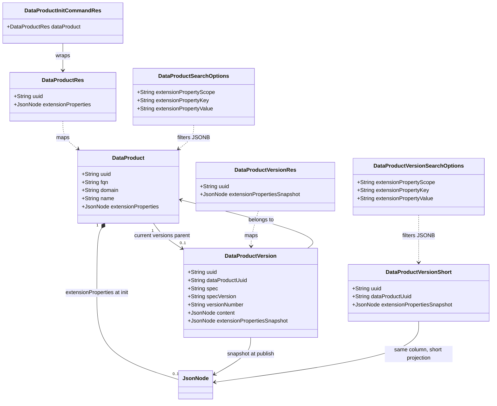

# Data product extension properties for client-declared lineage and scoped search

## Requirements

Implement opaque, scope-grouped extension metadata on the data product aggregate, accepted at initialization and carried immutably through normal registry APIs for this initiative, with a full snapshot on each published data product version; **only when** the published descriptor is **DPDS 1.x** (same classification already used for DPDS enrichment in the publisher pipeline), embed the extension snapshot by **deserialize → merge → serialize** using the parsed `org.opendatamesh.dpds.model.DataProductVersion`: each snapshot scope id and value is written into `ComponentBase`’s **`additionalProperties`** map (`getAdditionalProperties` / `setAdditionalProperties`), then the model is serialized back to JSON via `Parser.serialize`. Jackson’s `@JsonAnyGetter` on that map means published JSON still exposes each scope as a **top-level sibling** next to standard DPDS fields (e.g. `info`, `components`); there is **no** separate wrapper object named `additionalProperties` in the wire format. **Reject** extension scope ids that match reserved DPDS top-level bean property names (case-insensitive): `info`, `interfaceComponents`, `internalComponents`, `components`, `tags`, `externalDocs`, `dataProductDescriptor`. For all other descriptor specs or versions, **do not** alter `descriptor_content` for extension embedding—only persist the snapshot column; extend list/search for data products and data product versions by scope-key-value semantics; keep the registry decoupled from any blueprint service while enabling the UI to record blueprint instantiation lineage and parameters as client-attested values.

## Entities

## Approach

1. **Bounded context and API design**:
   - Treat extension data as registry-stored, client-declared opaque JSON: no blueprint identifiers, URLs, or semantics in Java types beyond structural validation (shape, size, duplicate scope rules).
   - Model storage as a single JSONB document on `data_products` shaped as an object whose top-level keys are **scope identifiers** (strings) and whose values are objects mapping **property key → JSON value** (primitive or nested JSON for instantiation parameters), so keys collide only within a scope.
   - Expose the same structure on `DataProductRes` for read and init input; do not add separate REST resources for scopes to avoid scope creep.

2. **Technical implementation**:
   - Use Spring Boot 3.x / JPA with `@JdbcTypeCode(SqlTypes.JSON)` on `JsonNode` (or `Map` + Jackson) mirroring `DataProductVersion.descriptor_content`; align Flyway migrations with `hibernate.ddl-auto: validate`.
   - Add matching JSONB column on `data_products_versions` for the publish snapshot; map it on both `DataProductVersion` and `DataProductVersionShort` so list queries can filter without loading full descriptor content.
   - **Descriptor embedding (mandated shape, DPDS 1.x only)**: After `enrichDescriptorContentIfNeeded` returns enriched JSON, **only** when the version’s descriptor spec/version classify as **DPDS 1.x** (same predicate as `DataProductVersionPublisherDpdsDescriptorOutboundPort` / `1\..*`), merge the snapshot by **parsing** with `Parser.deserialize` into `DataProductVersion`, copying each snapshot scope into the model’s **`additionalProperties`** map (preserving any pre-existing map entries), then **`Parser.serialize`**. **Reserved scope ids** (case-insensitive match to DPDS top-level property names listed in Requirements) must fail publish with `BadRequestException` (`Cannot publish: extension property scope '…' matches a standard DPDS top-level field name…`). If the map already contains a **non-null** value for a scope key that is **not JSON-equal** to the snapshot value for that scope, fail with `BadRequestException` (`… collides with an existing additional property on the descriptor…`). The merged document must pass `DescriptorValidator` on the serialized result. For **non–DPDS-1.x** descriptors, skip this merge; snapshot column behavior is unchanged.
   - **Search**: Add JPA `Specification` predicates using PostgreSQL **`jsonb_extract_path_text(extension_properties, scope, key)`** (and the analogue on `extension_properties_snapshot` for versions) compared with `CriteriaBuilder.literal(value)` for optional filters `extensionPropertyScope` + `extensionPropertyKey` + `extensionPropertyValue` (**exact** textual match to the extracted scalar representation in v1; document limitation if values are non-scalar). GIN `jsonb_path_ops` indexes remain on the JSONB columns for future containment-style filters.
   - Add **GIN** `jsonb_path_ops` indexes on `data_products.extension_properties` and `data_products_versions.extension_properties_snapshot` (as in Flyway) for future containment/path-style filters; **v1** list queries use `jsonb_extract_path_text` equality (no dedicated expression index in the initial migration).
   - **Exceptions**: Reuse `BadRequestException` / `RegistryApiException` and existing `ResponseExceptionHandler` for validation failures; do not introduce a parallel global handler.

3. **Business logic**:
   - **Init**: `DataProductsUseCasesService.initializeDataProduct` already maps `DataProductInitCommandRes` → entity; persist `extensionProperties` on create only when present; validate structure before save.
   - **Immutability (this story)**: On `DataProduct` overwrite/update paths used by existing APIs (`overwriteResource`, documentation update use case, approve/reject if they touch the entity), reject or ignore attempts to change `extensionProperties` once the product exists with non-null snapshot—prefer **reject with 400** if the incoming JSON differs from persisted to make misuse visible; empty/absent on first create allowed.
   - **Publish**: In `DataProductVersionPublisher.execute`, after loading `DataProduct`, copy `dataProduct.getExtensionProperties()` into `dataProductVersion.setExtensionPropertiesSnapshot(...)` (deep copy); after `enrichDescriptorContentIfNeeded`, when **DPDS 1.x**, call `DataProductVersionPublisherDescriptorOutboundPort.mergeExtensionPropertiesSnapshotAtDescriptorRoot` (implemented on `DataProductVersionPublisherDpdsDescriptorOutboundPort` via parsed-model **`additionalProperties`** merge), then `validateDescriptor` on the merged JSON, then assign final content; for other specs, leave descriptor content as enriched without extension merge into `descriptor_content`.
   - **Optional lineage**: All validation and publish paths tolerate null or `{}` extension documents.

## Structure

### Inheritance relationships

1. `DataProduct` entity extends `VersionedEntity` and gains a JSON-mapped extension field.
2. `DataProductVersion` and `DataProductVersionShort` entities map the same underlying `data_products_versions` table row; the short entity includes the snapshot column for query efficiency.
3. `BadRequestException` extends `RegistryApiException` for structural validation errors on extension payloads.

### Dependencies

1. `DataProductController` / `DataProductUseCaseController` continue to delegate to `DataProductsService` / `DataProductsUseCasesService`; DTOs carry new fields.
2. `DataProductMapper` maps extension fields between `DataProduct` and `DataProductRes`.
3. `DataProductInitializerFactory` / initializer use case persists `DataProduct` including extension properties through `DataProductsService` or persistence port.
4. `DataProductVersionPublisher` depends on `DataProductVersionPublisherDataProductPersistenceOutboundPort` to read the parent `DataProduct` and on `DataProductVersionPublisherDescriptorOutboundPort` for enrichment and **DPDS 1.x** extension merge (`mergeExtensionPropertiesSnapshotAtDescriptorRoot`); merge runs **only when the version is DPDS 1.x**, after enrichment and before `validateDescriptor` on the merged JSON.
5. `DataProductsServiceImpl.getSpecFromFilters` composes new JSONB `Specification` with existing `DataProductsRepository.Specs`.
6. `DataProductVersionsQueryServiceImpl.getSpecFromFilters` composes analogous specs via `DataProductVersionsShortRepository.Specs`.
7. `ResponseExceptionHandler` handles new validation errors without new exception types unless a dedicated subtype improves HTTP clarity.

### Layered architecture

1. **Controller layer**: Expose new optional query parameters on list endpoints; document OpenAPI for `DataProductSearchOptions` and `DataProductVersionSearchOptions`; no blueprint-specific query params.
2. **Service layer**: Structural validation component for extension JSON; orchestration in init and publish use cases; immutability enforcement on product updates.
3. **Repository layer**: Static `Specification` helpers for JSONB filters; optional native query fragments if Criteria API JSON support is insufficient.
4. **Data access layer**: Flyway SQL for columns and indexes; JSONB types.
5. **Exception handling layer**: Centralized via existing `ResponseExceptionHandler` and `ErrorRes`.

## Operations

### Create/Update database schema – Flyway migration `V{N}__data_product_extension_properties.sql`

1. **Responsibility**: Add nullable JSONB columns `extension_properties` on `data_products` and `extension_properties_snapshot` on `data_products_versions` (same physical column for full and short JPA mappings); create supporting indexes for search predicates.
2. **Attributes**: N/A (SQL script).
3. **Methods**: N/A.
4. **Logic**:
   - `ALTER TABLE ... ADD COLUMN` with `jsonb` default NULL (nullable columns).
   - `CREATE INDEX ... USING gin (extension_properties jsonb_path_ops)` and the same for `extension_properties_snapshot` (supports future containment/path-style filters; v1 list queries use `jsonb_extract_path_text` equality).
5. **Constraints**: Compatible with PostgreSQL dialect already used under `db/migration/postgresql`.

### Create/Update entity – `DataProduct`

1. **Responsibility**: Map `extension_properties` JSONB column.
2. **Attributes**:
   - `extensionProperties`: `JsonNode` – scope-grouped document.
3. **Methods**: Standard getters/setters.
4. **Annotations**: `@Column(columnDefinition = "jsonb")`, `@JdbcTypeCode(SqlTypes.JSON)`.
5. **Constraints**: Nullable; no cascade beyond existing `VersionedEntity` behavior.

### Create/Update entity – `DataProductVersion` and `DataProductVersionShort`

1. **Responsibility**: Map `extension_properties_snapshot` for publish-time copy.
2. **Attributes**: `extensionPropertiesSnapshot`: `JsonNode`.
3. **Methods**: Getters/setters.
4. **Logic**: `DataProductVersionShort` must include the field so `DataProductVersionsQueryServiceImpl` filters apply to listed rows.

### Create component – `DataProductExtensionPropertiesValidator` (package `org.opendatamesh.platform.pp.registry.dataproduct.services`)

1. **Responsibility**: Validate incoming JSON shape without interpreting owner semantics.
2. **Methods**:
   - `void validateOrThrow(JsonNode root)`:
     - **Logic**: If null or missing, return. If not object, throw `BadRequestException`. For each top-level field name, enforce non-blank scope id string and max length (e.g. 255). Value must be object (map of keys to JSON values). Enforce max document size (byte estimate or max keys per scope / max scopes). **Duplicate scope keys**: JSON object keys are unique by definition; if input parsed from array-of-scopes client format, normalize in API layer—prefer object map only. Reject keys longer than 255. Reject values that are not valid JSON types (no binary).
3. **Dependency injection**: Spring `@Component`, invoked from `DataProductsServiceImpl.validate` (after required fields) and from init use case before persistence.

### Update REST resources – `DataProductRes`, `DataProductVersionRes`, `DataProductVersionShortRes` (if exists)

1. **Responsibility**: Surface extension fields in API contracts.
2. **Attributes**: `JsonNode extensionProperties` on product; `JsonNode extensionPropertiesSnapshot` on version resources as appropriate for each response DTO shape.
3. **Annotations**: `@Schema` descriptions stating opaque, scope-grouped, client-owned data.

### Update mapper – `DataProductMapper`, `DataProductVersionMapper`

1. **Responsibility**: Map new fields bidirectionally; ensure `toEntity` does not strip unknown JSON.
2. **Methods**: Extend existing mapstruct or manual mapping methods.

### Update service – `DataProductsServiceImpl`

1. **Responsibility**: Validate extension properties; wire JSON search specs; enforce immutability on update.
2. **Core methods**:
   - `validate(...)`: call `DataProductExtensionPropertiesValidator`.
   - `beforeOverwrite(...)`: if persisted entity has non-null `extensionProperties` and incoming JSON differs, throw `BadRequestException` with message `Changing data product extensionProperties is not supported in this release; resend the same document or omit the field.`
   - `getSpecFromFilters(...)`: if all three extension filter fields are set, add `DataProductsRepository.Specs.hasExtensionPropertyTriple` (PostgreSQL `jsonb_extract_path_text`); if only one or two are set, throw `BadRequestException` with message `extensionPropertyScope, extensionPropertyKey, and extensionPropertyValue must all be provided together for extension property search`.
3. **Return value**: Unchanged CRUD contracts with enriched DTOs.

### Update service – `DataProductVersionsQueryServiceImpl`

1. **Responsibility**: Apply same optional JSONB filter triple to `DataProductVersionShort` queries via `jsonb_extract_path_text` on `extension_properties_snapshot`.
2. **Methods**: Extend `getSpecFromFilters` with `DataProductVersionsShortRepository.Specs.hasExtensionPropertyTriple`; if extension filters are partially set, throw `BadRequestException` with the same triple message as `DataProductsServiceImpl`.

### Update repository specs – `DataProductsRepository.Specs`, `DataProductVersionsShortRepository.Specs`

1. **Responsibility**: Predicate for scope/key/value using Criteria `cb.function("jsonb_extract_path_text", String.class, root.get("extensionProperties" | "extensionPropertiesSnapshot"), cb.literal(scope), cb.literal(key))` compared with `cb.literal(value)` (exact textual equality to PostgreSQL’s extracted scalar representation).
2. **Edge cases**: JavaDoc: scope and key are case-sensitive; value is exact match to extracted text (v1: suitable for string filters; non-scalar JSON limitations as in Approach).

### Update use case – `DataProductVersionPublisher`

1. **Responsibility**: Snapshot parent product extension JSON onto the version entity; when `descriptorHandlerPort.supportsExtensionRootMerge(spec, specVersion)` is true (**DPDS 1.x**), merge via `mergeExtensionPropertiesSnapshotAtDescriptorRoot` on the **enriched** JSON before persisting; otherwise leave enriched content unchanged for extension embedding.
2. **Methods** – `execute()` transaction lambda (order matters):
   - After loading `DataProduct`, set `extensionPropertiesSnapshot` to `deepCopyJsonNode(dataProduct.getExtensionProperties())` (always; null yields null snapshot).
   - `enrichedContent = enrichDescriptorContentIfNeeded(...)`.
   - `finalContent = supportsExtensionRootMerge(...) ? mergeExtensionPropertiesSnapshotAtDescriptorRoot(enrichedContent, extensionPropertiesSnapshot) : enrichedContent`; assign `dataProductVersion.setContent(finalContent)`.
   - Then `verifyDataProductFqnsMatch`, `validateDescriptor(spec, specVersion, finalContent)`, `extractVersionNumber`, save.
3. **Error handling**: Merge failures and reserved-scope / additional-property collision messages originate from `DataProductVersionPublisherDpdsDescriptorOutboundPort`; post-merge `validateDescriptor` failures use existing descriptor validation behavior.

### Update outbound port – `DataProductVersionPublisherDpdsDescriptorOutboundPort`

1. **Responsibility**: Implements `DataProductVersionPublisherDescriptorOutboundPort` for DPDS: `validateDescriptor`, `enrichDescriptorContentIfNeeded`, FQN/version extraction unchanged; `supportsExtensionRootMerge` true only when spec is `DPDS` (case-insensitive) and spec version matches `1\..*`.
2. **Methods**:
   - `mergeExtensionPropertiesSnapshotAtDescriptorRoot(enrichedDescriptor, extensionSnapshot)`: if snapshot null/absent/not object, return `enrichedDescriptor` unchanged; if enriched not object, return unchanged; else `parser.deserialize` → copy/merge snapshot scopes into `DataProductVersion`’s `additionalProperties` (`LinkedHashMap` preserving existing entries) → `parser.setAdditionalProperties` → `parser.serialize`. On deserialize failure, `BadRequestException("Failed to parse DPDS descriptor: …")`. Reserved scope ids (case-insensitive set: `info`, `interfaceComponents`, `internalComponents`, `components`, `tags`, `externalDocs`, `dataProductDescriptor`) throw `BadRequestException("Cannot publish: extension property scope '…' matches a standard DPDS top-level field name; choose a different scope identifier.")`. If `merged.get(scope)` is non-null and not JSON-equal to snapshot value, throw `BadRequestException("Cannot publish: extension property scope '…' collides with an existing additional property on the descriptor that does not match the snapshot.")`. Null snapshot values stored as `NullNode` in the map.

### Update integration tests – `DataProductUseCaseControllerIT`, `DataProductVersionUseCaseControllerIT` (publish)

1. **Responsibility**: Cover init with properties, list filter hits/misses (triple required), publish copies snapshot to the version column; for **DPDS 1.x**, assert the **serialized** descriptor exposes each extension scope as a **top-level JSON property** alongside standard DPDS keys (same values as product extension), matching the `additionalProperties` / `@JsonAnyGetter` wire shape; assert **non–DPDS-1.x** publishes leave descriptor JSON unchanged by extension merge (snapshot column still populated); cover reserved-scope publish failure, additional-property collision, descriptor validation failure, and overwrite rejection when `extensionProperties` changes.

### OpenAPI / controller parameter binding

1. **Responsibility**: Ensure Spring documents and binds new `DataProductSearchOptions` and `DataProductVersionSearchOptions` fields on GET list endpoints.

## Norms

1. **Annotation standards**: Use existing Jakarta persistence and Spring stereotypes; `@Schema` on new REST fields for OpenAPI parity.
2. **Dependency injection**: Constructor or field injection consistent with surrounding classes in each package.
3. **Exception handling**:
   - Use `BadRequestException` for client payload and immutability violations.
   - Do not leak stack traces in HTTP body; `ResponseExceptionHandler` already maps `RegistryApiException` to `ErrorRes`.
4. **Data validation**: Centralize JSON shape rules in `DataProductExtensionPropertiesValidator`; keep `DataProductsServiceImpl` field length validations unchanged for scalar fields.
5. **Logging**: Log validation failures at INFO with reason code; avoid logging full JSON blobs in production paths (size/sensitivity).
6. **Documentation standards**: JavaDoc on public validator and new repository spec methods describing filter semantics (`jsonb_extract_path_text`), and JavaDoc on merge describing **parsed `DataProductVersion` + `additionalProperties`** merge **restricted to DPDS 1.x**, including reserved scope ids and collision when an existing additional-property value differs from the snapshot.

## Safeguards

1. **Functional constraints**: Registry must not call blueprint or external catalog services; no server-side resolution of blueprint name/version strings. Notification, alignment workflows, and correction use cases for extension data remain out of scope.
2. **Performance constraints**: JSONB queries must use defined indexes; document maximum recommended document size (e.g. 64KB–256KB) enforced at validation.
3. **Security constraints**: Treat extension payload as untrusted data: size limits, no script execution, no SQL in client payloads; parameterized criteria/native fragments only.
4. **Integration constraints**: Backward compatible API: existing clients omitting new fields continue to work; new columns nullable.
5. **Business rule constraints**: Published `DataProductVersion` snapshot must reflect product state at publish transaction boundary. **Only for DPDS 1.x**: when a non-null object snapshot exists, merge into the parsed model’s **`additionalProperties`** and serialize so the published JSON exposes each scope as a **top-level sibling** (Jackson `@JsonAnyGetter`), with values JSON-equal to the snapshot (null scopes stored as JSON null). If post-merge `DescriptorValidator` rejects the document, publish fails with a client-visible error. For non–DPDS-1.x, do not alter `descriptor_content` for extensions; always persist the snapshot column from the product (deep copy) regardless of merge path.
6. **Descriptor merge constraints (DPDS 1.x only)**: Extension **scope ids** must not match reserved DPDS top-level property names (case-insensitive; list in Requirements). The registry must not silently clobber an existing **`additionalProperties`** entry: if a scope already exists with a non-null value **not JSON-equal** to the snapshot, publish fails with the collision `BadRequestException` message documented in Operations.
7. **Exception handling constraints**: All new failures use `RegistryApiException` subclasses handled by `ResponseExceptionHandler`; error messages must not expose internal SQL.
8. **Technical constraints**: Hibernate `ddl-auto: validate` must pass against migrated schema; both entity mappings for `data_products_versions` stay consistent.
9. **Data constraints**: Duplicate scope ids not applicable for object map; inner keys unique per scope by JSON object rules; reject unknown binary encodings.
10. **API constraints**: Search filters require consistent triple (scope, key, value) or documented partial behavior; OpenAPI descriptions must state string comparison semantics for `extensionPropertyValue`.
